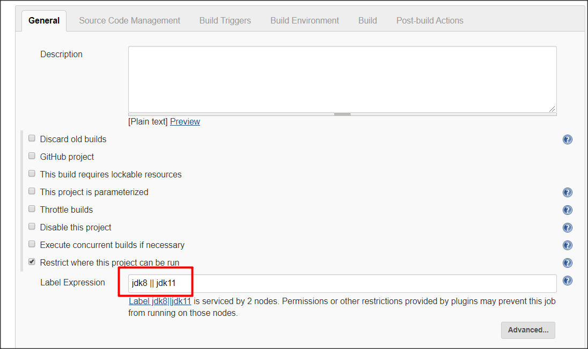
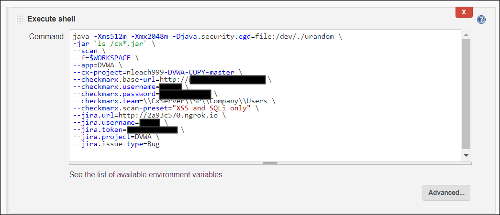

# Cx-Flow Demo/Development Instance

This repository will allow you to create a demonstration system with the following properties:

* Has a running instance of Jira where vulnerability issues will be created
* Hosts a Cx-Flow instance that can receive webhook notifications
* Easy setup for multiple different instance configurations

# Prerequisites
* You must have Docker Desktop installed
* Docker will need access to write to your local disk
* The Docker memory setting should be bumped to 8GB rather than the default 2GB to make the demo system more performant
* The Cx-Flow webhook endpoint must be available via a public Internet URL to receive webhook calls
    * It is possible to use a tool such as [ngrok](https://ngrok.com/) to allow Cx-Flow to receive webhook calls
* The current configuration is designed to work with GitHub webhooks, but it is possible to customize it to consume webhook data from other SCM providers

# Cx-Flow Invocation via Webhook Setup Instructions


## Step 1: Configure your environment

In the `cxflow-docker` directory there is a file `application-general.yml` that can be modified to provide Cx-Flow settings.  It is also possible to make one or more copies of `application-general.yml` in the cxflow-docker directory for multiple configurations.  The naming convention for configuration files is `application-{config name}.yml`.

For example, if it was neccessary to make a configuration named "mypoc", a copy of `application-general.yml` can be made with the name `application-mypoc.yml`.  The configuration option `mypoc` can be provided as an argument to one of the execution powershell scripts (described later in this document).

In the `application-general.yml` file, there are several configuration fields with `# TODO:` comments that must be configured prior to executing Cx-Flow. For a simple demonstration environment, the other configuration options can be left unmodified.

### Workflow Configurations for the Included application-*.yml Examples

* **application-general.yml** - This configuration uses GitHub as source control and Jira as the issue tracker.

* **application-github+ado.yml** - This configuration uses GitHub as source control and Azure DevOps as the issue tracker.


## Step 2: Run the Cx-Flow and Jira Server Containers

The powershell script `run_cxflow+jira_server.ps1` will start a Docker instance of Jira and a Cx-Flow webhook server.  The Jira data is persisted to a local disk so that the Jira contents survives across restarts.  Note that the Jira evaluation license is only for 30 days.  If the license expires, all that is required is to delete the local Jira data and restart the containers.

`run_cxflow+jira_server.ps1` has a few options:

Option | Default | Description
--- | --- | ---
StorageLoc | ./jira_data | The folder where Jira data will be stored.  By default, it creates the folder `jira-data` in the working directory.  An absolute or relative path can be provided to store the data in an alternate location.
Config | general | The configuration option used to locate the `application-{config name}.yml` file for Cx-Flow startup.  Using `-Config mypoc` would cause Cx-Flow to start with the configuration file `application-mypoc.yml`.
Dbg | false | Including `-Dbg` starts Cx-Flow with a debugger available for connecting via port 1040.

The Jira and Cx-Flow servers will execute and display log output in your powershell window.  Press CTRL-C at any time to shut down the containers.  It is possible to tail logs of each individual container.  See the [docker logs](https://docs.docker.com/engine/reference/commandline/logs/) and [docker ps](https://docs.docker.com/engine/reference/commandline/ps/) command documentation for more details.

## [Alternate] Step 2: Run CxFlow as a Webhook Server without Jira

The powershell script `run_cxflow_server.ps1` will start a Docker instance of a Cx-Flow webhook server.

`run_cxflow_server.ps1` options:

Option | Default | Description
--- | --- | ---
Config | general | The configuration option used to locate the `application-{config name}.yml` file for Cx-Flow startup.  Using `-Config mypoc` would cause Cx-Flow to start with the configuration file `application-mypoc.yml`.
Dbg | false | Including `-Dbg` starts Cx-Flow with a debugger available for connecting via port 1040.

## Step 3: Configure Jira

### *If you are not using Jira as the issue tracker, you can skip this step.*

By default, Jira will answer at the URL [http://localhost:8000](http://localhost:8000).  Jira will give options for setup which includes configuring a license.  The Jira configuration will allow you to navigate to the Atlassian site and generate a Jira evaluation license that will then be imported into your Jira instance.

When Jira has finished initializing, create an initial scrum software project with the name you provided in `application-{config name}.yml` under the `jira.project` configuration setting.  The `application-general.yml` configuration options have been configured to work with the default Jira project settings.  Configuring more advanced options is possible by customizing `application-{config name}.yml`, but this subject is beyond the scope of this document.

## Step 4: Configure the Webhook

### Testing Cx-Flow Configuration

By default, the Cx-Flow webhook server answers at [http://localhost:8585](http://localhost:8585).  By default all [Spring Boot Actuators](https://www.baeldung.com/spring-boot-actuators) have been enabled.  The use of the actuators is beyond the scope of this document, but some common actuators can be used to check that Cx-Flow is working:

Actuator Name | URL
--- | ---
Health | [http://localhost:8585/actuator/health](http://localhost:8585/actuator/health)
Info | [http://localhost:8585/actuator/info](http://localhost:8585/actuator/info)
ConfigProps | [http://localhost:8585/actuator/configprops](http://localhost:8585/actuator/configprops)


If the actuators don't respond or respond with errors, chances are that Cx-Flow is not configured correctly.

### Exposing Cx-Flow via a Public URL

For webhooks to be received, the Cx-Flow URL must be reachable from the public Internet.  For demonstration purposes, it is often possible to use a tool like `ngrok` as a reverse proxy with a publicly accessible url.  Execute `ngrok` with the following command line to obtain the webhook URL:

`.\ngrok.exe http 8585`

The URL given by ngrok can be used as the webhook endpoint when configuring the webhook with the SCM provider.

### Configuring a GitHub Webhook

1. Navigate to the GitHub code repository used for the demonstration.
2. Navigate to Setting->Webhooks.
3. Set the "Payload URL" to the ngrok URL or the publicly accessible URL for Cx-Flow.
4. Set the "Content Type" to `application/json`.
5. Set the "Secret" to the value supplied for `github.webhook-token` in `application-{config name}.yml`.
6. The events that trigger the webhook can be set to "Just push the event" or tuned for more specific events as needed.

## Step 5: Demonstrate

If everything has been configured correctly, pushing a change to the repository should deliver a webhook call to the Cx-Flow endpoint.  A scan should be invoked in the CxSAST server, and the results will be published as issues in Jira.

# Cx-Flow Invocation via Command Setup Instructions

Cx-Flow has the ability to be invoked from the command line rather than via webhook.  This invocation method makes it possible to integrate Cx-Flow with a CI/CD tool's build pipeline.

If the Cx-Flow webhook and Jira server are running, it is possible to demonstrate the Cx-Flow workflow to the example Jira server.  The Docker Compose that runs the Cx-Flow webhook and Jira server relies on the Docker overlay network to allow Cx-Flow to find the Jira server.  For non-webhook invocations of Cx-Flow, the Jira server can not be located using this method.  With `ngrok` it is possible to make the Jira server publicly accessible and therefore locatable to Cx-Flow invocations via CI/CD tool.  The following command will expose the Jira server via a public URL:

`.\ngrok http 8000`

The URL provided by ngrok can be used in the following examples to allow Cx-Flow to update results in the same Jira instance used by the Cx-Flow webhook.  Note that for the free version of `ngrok`, the number of calls to Jira may go over the 20 connection-per-second limit and result in errors.  If the CI/CD tool is being invoked from a machine on the same subnet as the machine hosting Jira/Cx-Flow, the IP address of the container hosting machine may be used instead of `ngrok` (e.g. "http://192.168.0.254:8000").


## Invoke Cx-Flow from Powershell

The powershell script `run_cxflow.ps1` will invoke Cx-Flow with the capability of using the same configuration as is used for the webhook instance of Cx-Flow.  The following options may be used:

Option | Default | Description
--- | --- | ---
Config | general | The name of the configuration to use.  Resolved to `application-{config name}.yml` when executing Cx-Flow.
JiraURL | N/A | The URL to the Jira instance.
CxProject | N/A | The name of the project where the scan will be processed in CxSAST.
Src | N/A | The directory with the source code to submit for scanning
Dbg | false | If included, invokes Cx-Flow with a debugger open on port 1039.


## Invoke Cx-Flow from Jenkins

The [JenkinsDemoInstance](../JenkinsDemoInstance) has added support to invoke Cx-Flow from a Jenkins build definition.  This example is one of many ways it can be performed.  In this example, most of the configuration options are defined on the command line rather than using the `application-{config name}.yml` file. While it is possible to utilize a YAML configuration file or even the Cx-Flow config-as-code capabilities to better manage configuration options, these concepts are beyond the scope of this document.

The [JenkinsDemoInstance](../JenkinsDemoInstance) build agents have the Cx-Flow jar as part of the build agent container image.  It is therefore necessary to limit the build execution to one of the build agent machines.  In the example below, the "Restrict where this project can be run" is set to the expression `jdk8 || jdk11` to allow the Cx-Flow build to execute on either of the example agents.




As part of the build, the "Execute shell" build step is configured to execute Cx-Flow with several of the options overridden via the command line.



The build script below can be customized to execute Cx-Flow when running on a build agent in a [JenkinsDemoInstance](../JenkinsDemoInstance):

```
java -Xms512m -Xmx2048m -Djava.security.egd=file:/dev/./urandom \
-jar `ls /cx*.jar` \
--scan \
--f=$WORKSPACE \
--app={PUT YOUR IDENTIFIER HERE} \
--cx-project={PUT YOUR CXSAST PROJECT NAME HERE} \
--checkmarx.base-url={PUT YOUR CXSAST URL HERE} \
--checkmarx.username={PUT YOUR CXSAST USERNAME HERE} \
--checkmarx.password={PUT YOUR CXSAST PASSWORD HERE} \
--checkmarx.team=\\CxServer\\SP\\Company\\Users \
--checkmarx.scan-preset="XSS and SQLi only" \
--jira.url={PUT YOUR JIRA URL HERE} \
--jira.username={PUT YOUR JIRA USERNAME HERE} \
--jira.token={PUT YOUR JIRA PASSWORD HERE} \
--jira.project={PUT YOUR JIRA PROJECT NAME HERE} \
--jira.issue-type=Bug

```

It is possible to use the Jenkins Credential Binding plugin to avoid placing credentials in the script, but this concept is beyond the scope of this document.