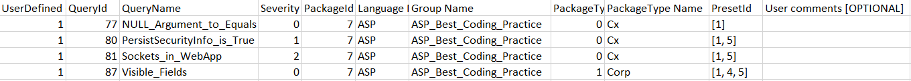

# CxSeverityOverride

A tool that helps in changing the severity of the queries.

## Description

This tool performs the following operations.
1) Change the severity of a query(or queries).
2) Add the queries to any number of presests.
3) Change the Type of query group (Cx/Corp/Project/Team)


## Getting Started

### Dependencies

  * Windows 10 or Server 2016
  * Python 3.8 or later
  * Python Library - pyodbc (installed through pip)
  * ODBC Data Source Administrator (Windows)

### Installation

* Downloading the solution

* Required Configuration -
	1. Install python.
	2. Install 'pyodbc' using PIP, eg: 'pip install pyodbc'.
	3. Create an ODBC database connection for Cx SQL Server instance:
		a. Open 'ODBC Data Sources' from Start Menu. Depening on the type of installed python, select 32 0r 64 bit.
		b. Under the 'System DSN', click 'Add' and select 'SQL Server' from the list of drivers.
		c. Enter the name of the data source as 'checkmarx'.
		d. The server address for a local SQL Server database would be: '.\SQLEXPRESS'
		e. Set default database to CxDB.
		f. You use integrated authentication or SQL authentication, depending on your database setup.

### Things to know


#### Severity Types
Severity | Value
|---|---|
Informational | 0
Low 		  | 1
Medium 		  | 2
High 		  | 3
	
#### PackageType values	
PackageType | PackageTypeName 
|---|---|
0 |	Cx	
1 |	Corp
2 |	Project
3 |	Team

##### Columns in 'query.csv' file

No. | Name | Allowed to change | Allowed values | Comments
|---|---|---|---|---|--|
1| UserDefined  | Yes | 1-No, 2-Yes    | To specify that the query details are modified. To be used in query.csv
2| QueryId 		| No  | Not Applicable | QueryId from db.
3| QueryName 	| No  | Not Applicable | QueryName from db.
4| Severity 	| Yes | (0/1/2/3)      | Refer Severity table for allowed values.
5| PackageId 	| No  | Not Applicable | PackageId of the package(group) to which the query belongs.
6| Langauge 	| No  | Not Applicable | Language for the query.
7| Group Name 	| No  | Not Applicable | Name of the package(group) to which the query belongs.
8| PackageType 	| Yes | (0/1/2/3) 	   | Refer the PackageType table for allowed values.
9| PackageType Name | Yes | Cx/Corp/Project/Team | Refer the PackageType table for allowed values.
10| PresetId 	| Yes | List of PresetIds | Refer the presets.csv for available PresetIds.
11| User Comments | Yes | Not Applicable | This column is optional and can be used for documenting the changes being made to query.




### Execution

* Execution Flow -
1) Fetch all the presets and the queries from db
2) Do any of the following:
	a) Modify the severity of the query
	b) Modify the package type of the query
	c) Add the query to any preset
3) Run the import script to push your changes to db.
	
1. To export the available queries from CxDB, run this command : 
````
py export_query_info.py
````
 * This will generate two csv files.
	a. presest.csv - This includes all the available presets along with their preset ids. This file is only used for reference to preset ids.
			
	b. query.csv - This includes all the details required to update the severity,package type or preset of the queries.
			
2. Open the 'query.csv' file and make the changes to any of the allowed fields.
	a. To update the severity, refer the values for severity and update the value under the column no 3.
	b. To change the packageType of the query, refer the PackageType table and update the id and the corresponding type name under the columns 8 and 9.
	c. To add the query to any preset, refer the preset id from 'presets.csv' and add this id under the column 10.
	
3. Once the desired query details are filled, change the value corresponding to this query row under the column 1, to '2' (which means this row has been modified).

4. Open command prompt in the same location and run the following command:
````
py import_into_db.py
````


## Contributing

We appreciate feedback and contribution to this repo! Before you get started, please see the following:

- [Checkmarx general contribution guidelines](https://github.com/checkmarx-ts/open-source-template/blob/master/GENERAL-CONTRIBUTING.md)
- [Checkmarx code of conduct guidelines](https://github.com/checkmarx-ts/open-source-template/blob/master/CODE-OF-CONDUCT.md)


