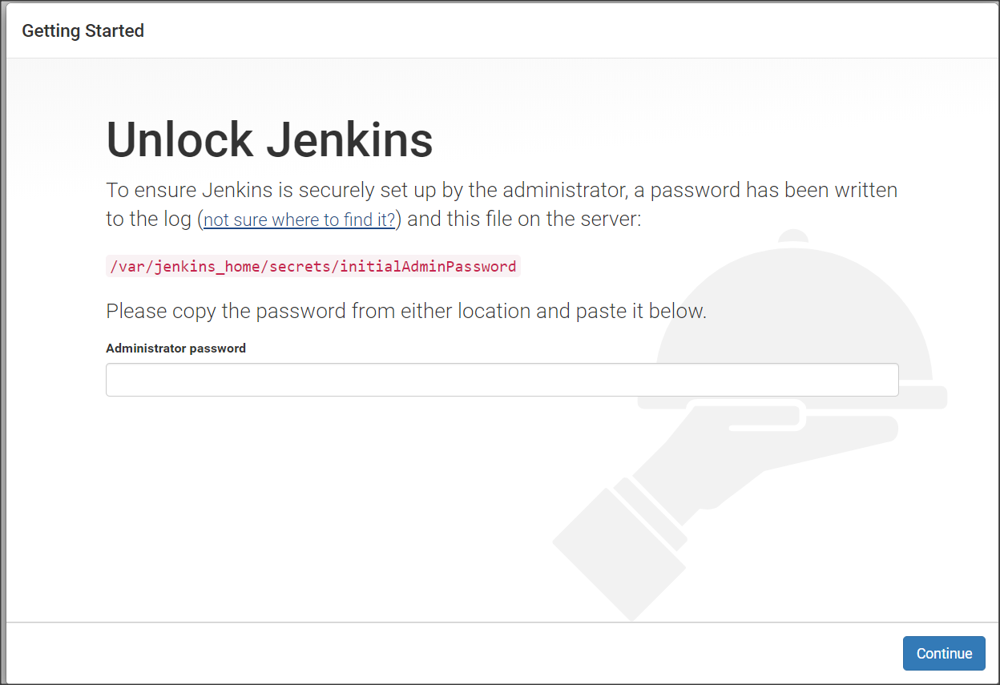
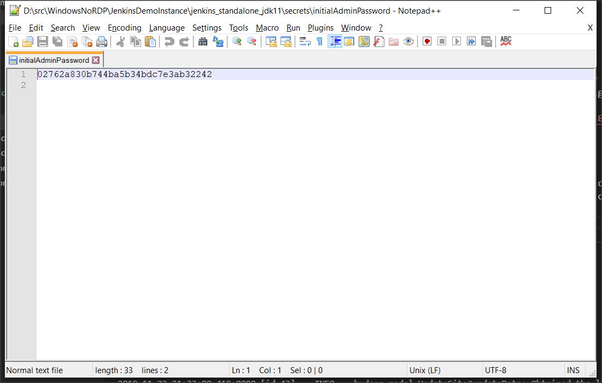
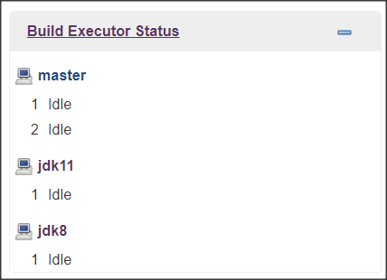
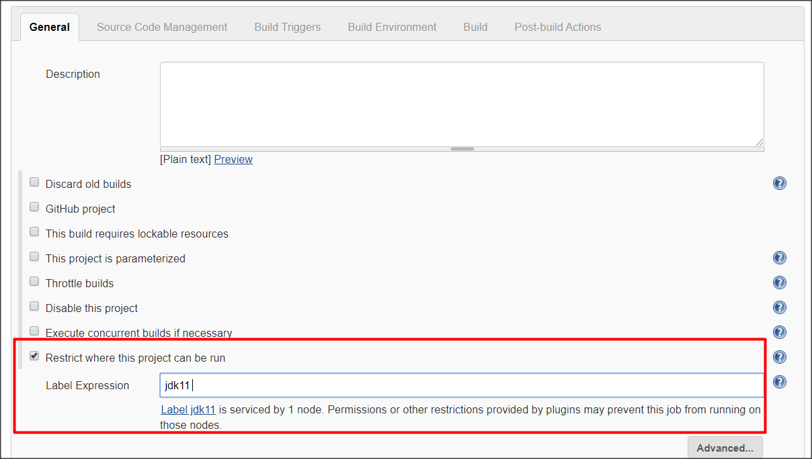

# Jenkins Demonstration Instance

Jenkins, as a widely used [Continuous Integration](https://www.checkmarx.com/2017/06/25/z-guide-continuous-integration/) tool, can be a valuable method to demonstrate how Checkmarx integrates into the the [Secure SDLC](https://www.checkmarx.com/solutions/by-implementation/secure-sdlc).  This powerhack uses Docker Desktop to create an instance of Jenkins that can be used for demonstration and development debugging purposes.

## Prerequisites & Assumptions

* The current implementation assumes that Docker desktop is installed and functioning on the machine where the containers will execute.

* The Docker daemon will require access to your local drives for this to function.

* The current scripting implementation executes under Windows Powershell.


## Standalone Jenkins Instance with Java 8 or Java 11


### Powershell Script `run_jenkins_standalone_jdk8.ps1`

This script will execute an instance of Jenkins running as a single node under a Java 8 JVM.

Execution of the script without any options will execute the standalone instance until CTRL-C is pressed:

```PS D:\src\CxPsPowerHacks> .\run_jenkins_standalone_jdk8.ps1```

By default, the Jenkins instance will initialize by writing into the directory `jenkins_standalone_jdk8` and can be accessed via [http://localhost:8080](http://localhost:8080).  Command line options can change this behavior:

Option | Default Value | Description
-------|---------------|------------
-StorageLoc | jenkins_standalone_jdk8 | The relative or full path of the directory where Jenkins will create all required installation artifacts.
-Port | 8080 | The port where the Jenkins UI will answer.
-Debug | false | Run the Jenkins instance with the ability for a Java debugger to connect.
-JenkinsImage | jenkins/jenkins:lts | The Docker image and tag to use as hosted on [Docker Hub](https://hub.docker.com/r/jenkins/jenkins).


### Powershell Script `run_jenkins_standalone_jdk11.ps1`

This script will execute an instance of Jenkins running as a single node under a Java 11 JVM.

Execution of the script without any options will execute the standalone instance until CTRL-C is pressed:

```PS D:\src\CxPsPowerHacks> .\run_jenkins_standalone_jdk11.ps1```

By default, the Jenkins instance will initialize by writing into the directory `jenkins_standalone_jdk11` and can be accessed via [http://localhost:8080](http://localhost:8080).  Command line options can change this behavior:

Option | Default Value | Description
-------|---------------|------------
-StorageLoc | jenkins_standalone_jdk11 | The relative or full path of the directory where Jenkins will create all required installation artifacts.
-Port | 8080 | The port where the Jenkins UI will answer.
-Debug | false | Run the Jenkins instance with the ability for a Java debugger to connect.
-JenkinsImage | jenkins/jenkins:lts-jdk11 | The Docker image and tag to use as hosted on [Docker Hub](https://hub.docker.com/r/jenkins/jenkins).


## Master/Agent Jenkins Instance with Java 8 or Java 11

The Master/Agent instance functions similarly to the standalone Jenkins instances.  The Master instance may be used to execute builds on Agent instances rather than building on the Master instance.  This capability is often used to scale the number of concurrent builds that can be executed by Jenkins.  This may also be used to create pools of build agents that have different build capabilities.  In this case, the demonstration environment is simulating using build agents for JDK 8 and JDK 11.  The Master may execute using a Java 8 or a Java 11 JVM in this scenario.

*There are additional configuration steps required after running the cluster containers.  See the section titled [Initialization of a Jenkins Cluster](#Initialization-of-a-Jenkins-Cluster)*

*When running a Jenkins Master/Agent configuration, the Jenkins instance always answers on port 8080 ([http://localhost:8080](http://localhost:8080))


### Powershell Script `run_jenkins_cluster_jdk8.ps1`

This script will execute an instance of Jenkins running as a Master/Agent cluster.  The Master will execute in a Java 8 JVM and will have a JDK 8 and JDK 11 build agent.


Execution of the script without any options will execute the Master/Agent cluster until CTRL-C is pressed:

```PS D:\src\CxPsPowerHacks> .\run_jenkins_cluster_jdk8.ps1```

By default, the Jenkins instance will initialize by writing into the directory `jenkins_cluster_jdk8` and can be accessed via [http://localhost:8080](http://localhost:8080).  Command line options can change this behavior:

Option | Default Value | Description
-------|---------------|------------
-StorageLoc | jenkins_cluster_jdk8 | The relative or full path of the directory where Jenkins will create all required installation artifacts.
-JenkinsImage | jenkins/jenkins:lts | The Docker image and tag to use for the Master as hosted on [Docker Hub](https://hub.docker.com/r/jenkins/jenkins).


### Powershell Script `run_jenkins_cluster_jdk11.ps1`

This script will execute an instance of Jenkins running as a Master/Agent cluster.  The Master will execute in a Java 11 JVM and will have a JDK 8 and JDK 11 build agent.


Execution of the script without any options will execute the Master/Agent cluster until CTRL-C is pressed:

```PS D:\src\CxPsPowerHacks> .\run_jenkins_cluster_jdk11.ps1```

By default, the Jenkins instance will initialize by writing into the directory `jenkins_cluster_jdk11` and can be accessed via [http://localhost:8080](http://localhost:8080).  Command line options can change this behavior:

Option | Default Value | Description
-------|---------------|------------
-StorageLoc | jenkins_cluster_jdk11 | The relative or full path of the directory where Jenkins will create all required installation artifacts.
-JenkinsImage | jenkins/jenkins:lts-jdk11 | The Docker image and tag to use for the Master as hosted on [Docker Hub](https://hub.docker.com/r/jenkins/jenkins).


# General Initialization of the Jenkins Instance

In either Standalone or Master/Agent instances of Jenkins, a secret key is created by Jenkins upon startup.  The secret key must be pasted into the Jenkins web interface to allow the completion of the Jenkins configuration.

After staring any Jenkins instance, navigating to the web UI (e.g. [http://localhost:8080](http://localhost:8080) ) eventually displays the following page:



The install directory (set by default or with the `-StorageLoc` command line option) contains the file `${StorageLoc}/secrets/initialAdminPassword`.  Opening this file will reveal the admin secret password that can be copied and pasted into the Jenkins UI.



Once the administration password is provided, the Jenkins initialization can be completed.

# Initialization of a Jenkins Cluster

A bit more initialization is required for Master/Agent cluster instances.  Without the additonal configuration, the Jenkins Master/Agent cluster will only function like a standalone instance.

## Disabling Security

To allow the agents to connect to the master without the need to configure each agent with a dynamically generated shared-secret, Jenkins security must be turned off.

**WARNING: It is not advised that an instance with security disabled is made accessible to the public Internet.**

To disable security:

1. Click "Manage Jenkins"
2. Click "Configure Global Security"
3. Uncheck "Enable Security"
4. Click "Save"


## Creating the Agent Nodes

The Jenkins cluster must be aware of the nodes that will be connecting to the Master.  To create the agent nodes:

1. Click "Manage Jenkins"
2. Click "Manage Nodes"
3. Click "New Node"
4. Use the node name "jdk8"
5. Select the "Permanent Agent" radio button
6. Click "OK"
7. Set the remote root directory to "/"
8. Set the label to "jdk8"
9. In the "Launch Method" dropdown, select "Launch agent by connecting it to the master"
10. Click "Save"

Repeat steps 1-10 using "jdk11" as the name in step 4 and the label in step 8.

If the configuration was completed successfully, the "Build Executor Status" should show that the agents "jdk8" and "jdk11" are available and idle after approximately 30 seconds.




# Installing the Checkmarx Jenkins Plugin

Instructions for installing and configuring the Checkmarx plugin for Jenkins may be found [here](https://checkmarx.atlassian.net/wiki/spaces/KC/pages/55410740/Setting+Up+the+Jenkins+Plugin).

As of the writing of this document (November 2019), the official Checkmarx Jenkins plugin does not function when running under Java 11.  The Checkmarx Professional Services group maintains a version of the Checkmarx Jenkins plugin that is compatible with Java 11 in the [checkmarx-ts GitHub repository](https://github.com/checkmarx-ts/checkmarx-plugin/releases).  This version must be manually installed.

## Installing a Downloaded Plugin: Via Jenkins Upload

1. Download the release zip archive of the version appropriate for your environment from the [checkmarx-ts GitHub repository](https://github.com/checkmarx-ts/checkmarx-plugin/releases)
2. Unzip the downloaded file to obtain the .hpi file included in the archive
3. In the Jenkins web UI, click "Manage Jenkins"
4. Click "Manage Plugins"
5. Select the "Advanced" tab
6. Under the "Upload Plugin" section, click "Choose File"
7. Select the ".hpi" file extracted from the zip archive and click "Open"
8. Click "Upload"
9. Wait for the plugin upload to complete
10. Follow [the instructions](https://checkmarx.atlassian.net/wiki/spaces/KC/pages/55410740/Setting+Up+the+Jenkins+Plugin) for configuring the Checkmarx Jenkins Plugin


## Installing a Downloaded Plugin: Via File Drop and Jenkins Restart

1. Download the release zip archive of the version appropriate for your environment from the [checkmarx-ts GitHub repository](https://github.com/checkmarx-ts/checkmarx-plugin/releases)
2. Unzip the downloaded file to obtain the .hpi file included in the archive
3. Copy the ".hpi" file into the folder `${StorageLoc}/plugins`
4. Restart the Jenkins instance
5. Follow [the instructions](https://checkmarx.atlassian.net/wiki/spaces/KC/pages/55410740/Setting+Up+the+Jenkins+Plugin) for configuring the Checkmarx Jenkins Plugin


# Debug Ports

Ports for connecting a Java debugger are opened when running standalone Jenkins instances using the `-Debug` flag when executing the script.  The script that starts a Jenkins Master/Agent cluster opens debug ports by default.  This is useful when debugging the Checkmarx Jenkins plugin as it executes.

Debug Port | Destination in Standalone | Destination in Cluster
-----------|------------|--------
1044 | N/A | Master Node
1041 | JDK 11 | JDK 11 Agent
1048 | JDK 8 | JDK 8 Agent


# Notes about Storage location

The persistant storage created by any Jenkins instance using these scripts is generally compatible with all Jenkins instances.  In many cases, the `-StorageLoc` parameter provides a default location for the convenience of creating the instance logically separated from other instances.  Using the command line parameter `-StorageLoc jenkins_standalone_jdk11` when executing `run_jenkins_cluster_jdk8.ps1` will launch a valid, working instance of Jenkins using a Java 8 JVM.

Keep in mind, however, that Agents named in a Master/Agent instance may not exist.  Build definitions that specify an agent tag may not work if that agent is not currently running.

# Freestyle & Pipeline Assignment

It is possible to restrict where a scan can be executed in Freestyle and Pipeline builds.

## Freestyle Builds

In the build configuration, select "Restrict where this project can run" and supply an agent label.  Execution of the Freestyle definition will now be limited to agents with the selected tag.



## Pipeline Builds

The agent label is specified in the section under the  `agent` directive.  Below is an example of a simple pipeline script.

```

pipeline {
   agent { label 'jdk8'}

   stages {
      stage('Source Pull')
      {
          steps {
              git 'https://github.com/nleach999/DVWA-COPY.git'
          }
      }
      stage('Checkmarx Scan') {
         steps {
            step([$class: 'CxScanBuilder', comment: '', credentialsId: '', excludeFolders: '', excludeOpenSourceFolders: '', exclusionsSetting: 'global', failBuildOnNewResults: false, failBuildOnNewSeverity: 'HIGH', filterPattern: '''!**/_cvs/**/*, !**/.svn/**/*,   !**/.hg/**/*,   !**/.git/**/*,  !**/.bzr/**/*, !**/bin/**/*,
            !**/obj/**/*,  !**/backup/**/*, !**/.idea/**/*, !**/*.DS_Store, !**/*.ipr,     !**/*.iws,
            !**/*.bak,     !**/*.tmp,       !**/*.aac,      !**/*.aif,      !**/*.iff,     !**/*.m3u, !**/*.mid, !**/*.mp3,
            !**/*.mpa,     !**/*.ra,        !**/*.wav,      !**/*.wma,      !**/*.3g2,     !**/*.3gp, !**/*.asf, !**/*.asx,
            !**/*.avi,     !**/*.flv,       !**/*.mov,      !**/*.mp4,      !**/*.mpg,     !**/*.rm,  !**/*.swf, !**/*.vob,
            !**/*.wmv,     !**/*.bmp,       !**/*.gif,      !**/*.jpg,      !**/*.png,     !**/*.psd, !**/*.tif, !**/*.swf,
            !**/*.jar,     !**/*.zip,       !**/*.rar,      !**/*.exe,      !**/*.dll,     !**/*.pdb, !**/*.7z,  !**/*.gz,
            !**/*.tar.gz,  !**/*.tar,       !**/*.gz,       !**/*.ahtm,     !**/*.ahtml,   !**/*.fhtml, !**/*.hdm,
            !**/*.hdml,    !**/*.hsql,      !**/*.ht,       !**/*.hta,      !**/*.htc,     !**/*.htd, !**/*.war, !**/*.ear,
            !**/*.htmls,   !**/*.ihtml,     !**/*.mht,      !**/*.mhtm,     !**/*.mhtml,   !**/*.ssi, !**/*.stm,
            !**/*.stml,    !**/*.ttml,      !**/*.txn,      !**/*.xhtm,     !**/*.xhtml,   !**/*.class, !**/*.iml, !Checkmarx/Reports/*.*''',
            fullScanCycle: 10, 
            groupId: '', 
            includeOpenSourceFolders: '', 
            osaArchiveIncludePatterns: '*.zip, *.war, *.ear, *.tgz', 
            osaInstallBeforeScan: false, 
            password: '<snip>', 
            preset: '3', 
            projectName: 'DVWA Pipeline Scan', 
            sastEnabled: true, 
            serverUrl: '<snip>', 
            sourceEncoding: '1', 
            username: '', 
            vulnerabilityThresholdResult: 'FAILURE', 
            waitForResultsEnabled: true])
         }
      }
   }
}


```