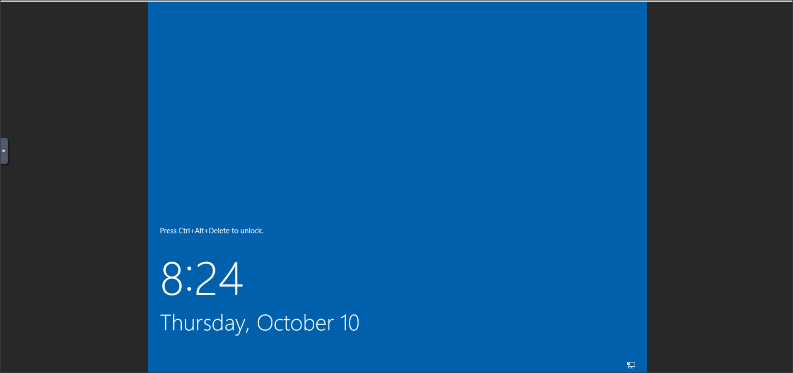
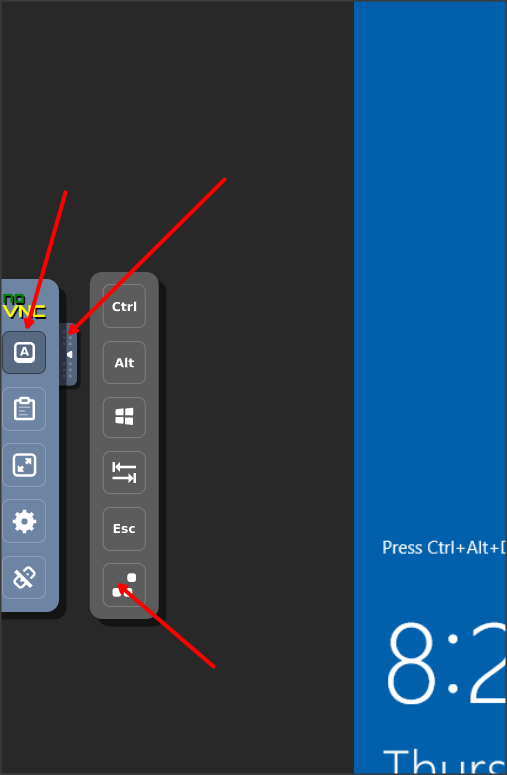

# Interactive Login without RDP

When attempting to use a machine created for a POC or training, it is often difficult to obtain RDP access to those machines. Many corporate intranets block port 3389 resulting in the need to create firewall rule exceptions.  This introduces significant difficulty when trying to conduct a short-term POC or training session. 

Most corporate intranets do not block port 80 as a general rule.  They may have content filtering proxies, but POC and training VMs are often not blacklisted by the content filters. 

This powershell script will configure a machine to allow a user to create an interactive login session using only web browser access over port 80.

## Warning
This script allows unecrypted access over port 80.  It is not advised to use it in a scenario where sensitive data (such as intellectual property) is viewed during the desktop session.  Further work may need to be done to allow this to work over an encrypted HTTPS session.

## Prerequisites

* This has been tested on Windows 2012 and 2019 server.
* You need RDP access to the machine to execute the setup script initially.

## How to Install

1. Log in to the target machine via RDP
2. Open Powershell as an Administrator
3. Execute SetupNoVNC.ps1
4. When the script is finished, use your browser to navigate to http://{hostname}/vnc

## How to Use

Navigate to http://{hostname}/vnc to view the "NoVNC" landing page.

(Optional) Click the gear icon on the left to configure the scaling mode to **Local Scaling** and turn on the option to **Show Dot when No Cursor**.  (There may be an issue with Windows showing the mouse cursor) 

Click **Connect** to start the VNC session.

Click the tab to the left of the screen open the VNC client options window.  Click **Extra Keys** and then click the **CTRL-ALT-DELETE** button to start the login session.

Login to the desktop as you would with any other interactive session.

Once logged in, display settings may be modified to adjust the size of the desktop.  If the **Local Scaling** option has been set, the screen size will scale to fit in the browser.
