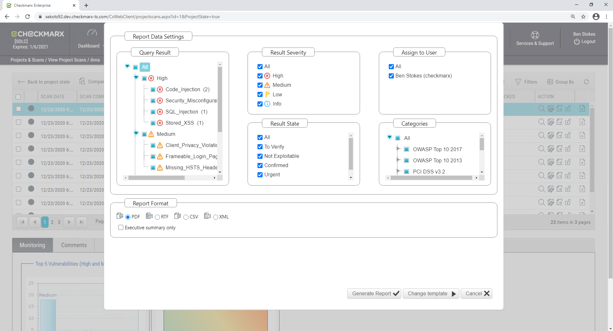
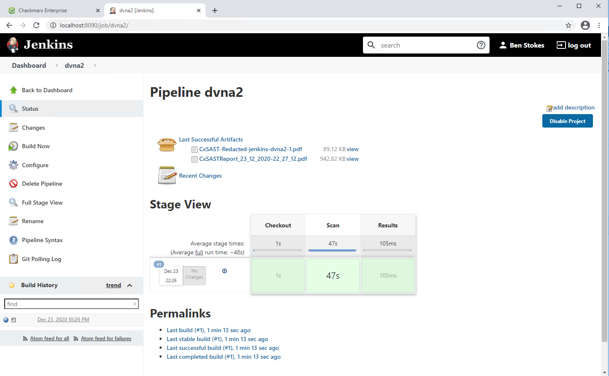
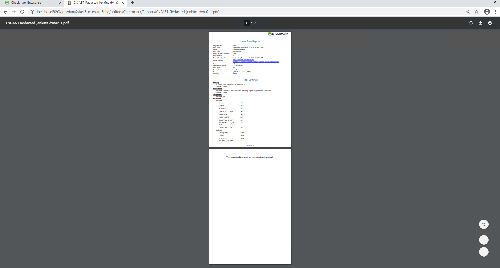
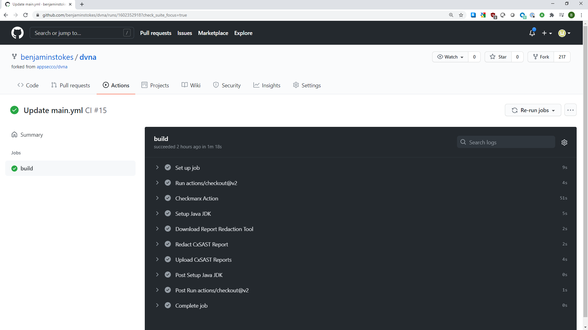
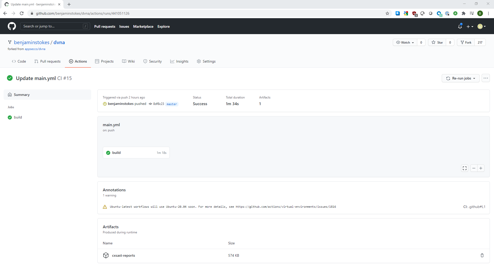

# cxsast-report-redaction

Creates redacted PDF CxSAST Reports that only contain scan metadata and do not contain any vulnerability details. 

# Overview
This is a Maven style Java project that produces an executable jar to be used alone or together with many Checkmarx 
plugins that generate PDF reports, and, are also Java based. So this utility can be used anywhere those plugins are used
with few additional requirements.  

It is a best practice in Checkmarx to *not* use PDF reports for consuming and triaging your results. That work is best
done within the Checkmarx web portal and plugins.  This tool and the PDF reports generated by Checkmarx are intended to 
support archival use cases. **PDF reports should not form the basis of your result review or triage processes.** 

# How it works
Given a PDF file, this utility will:
* Clone the first page, which contains only metadata, into a new PDF document
* Add a second page stating the rest of the report has been intentionally redacted
* Save the redacted PDF file

# What does a redacted report contain?

Metadata. It has these fields of metadata from the first page of the report.

* Scan Start Date & Time
* Scan Preset
* Scan Type (Full or Incremental)
* Lines of Code scanned
* Files Count
* Project Name
* Team
* Source Origin
* Scan Elasped Time
* Checkmarx Version
* Density
* Visibility
* Report Creation Time
* Link to Scan results in Checkmarx web portal

It does not contain any vulnerability data.


# Usage

First, install java and obtain the jar file. Those are the only requirements to run.

Create a redacted report in the current directory:

`java -jar cxsast-pdf-report-redactor<version>.jar /path/to/original.pdf`

The redacted report will be created in the current directory with a filename `redacted-report.pdf`.
You can then rename the file as needed and pull in environmental information like a build number:

`mv redacted-report.pdf "${NAME}_${BUILD}_redacted.pdf`

Optionally provide a second argument for the output file:

`java -jar cxsast-pdf-report-redactor<version>.jar /path/to/original.pdf /path/to/redacted.pdf`


### Arguments Reference
Arguments are by position.

Position | Description
--------|------------
`0` | **REQUIRED.** The absolute path to the PDF file that you want to redact
`1` | OPTIONAL. The absolute path for the redacted report. Default: `redacted-report.pdf` in the currnen directory.


# How To Guides
Here are examples on how to use this tool.
* A report from the CxSAST GUI
* CxSAST CLI Plugin
* Containerized build environments
* CxSAST Jenkins Plugin 
* CxSAST Github Action


These examples are intentionally pared-down to demonstrate scanning and report redaction in an attempt to make them easy to understand and therefore easy to integrate into your environment.
Some things you should consider when using this in your environment are:

* How will you obtain the jar file? The examples download it from Github. Will that work in your environment? Do you need to use an internal cache or repository?
* How will you name report files? There are a number of environment variables available in build tools that can be used. The Jenkins and Github Actions examples demonstrate this. 

## A report from the CxSAST GUI

In your CxSAST Web Portal, generate a report for a scan using the default options. 



Click Generate Report. Wait for the report to be downloaded. 

Download and install Java.

Download this utility's jar file to your machine. It is available [here](Artifacts)

Create the redacted PDF report:

`java -jar "C:\Users\Administrator\Downloads\cxsast-pdf-report-redactor-0.0.1-SNAPSHOT-jar-with-dependencies.jar" "C:\Users\Administrator\Downloads\dvna.pdf"`

The redacted report is created in your current directory. Open the redacted-report.pdf file and check it out.


##  CxSAST CLI

Download and install Java. It should be on your path. Check with `java -version` from the command line.
```
PS C:\Users\Administrator> java -version
openjdk version "1.8.0_275"
OpenJDK Runtime Environment (AdoptOpenJDK)(build 1.8.0_275-b01)
OpenJDK 64-Bit Server VM (AdoptOpenJDK)(build 25.275-b01, mixed mode)
```

Download the Checkmarx CLI plugin from https://www.checkmarx.com/plugins/ and unzip it to your system.

From the CLI folder you unzipped, run a SAST scan on a project. Make sure that `-ReportPDF $some_path` is part of your CLI arguments.
See https://checkmarx.atlassian.net/wiki/spaces/SD/pages/1339424904/CLI+Plugin for additional CLI documentation.

```
.\runCxConsole.cmd scan `
   -ProjectName "CxServer\dvna" `
   -LocationType "GIT" `
   -LocationURL "https://github.com/appsecco/dvna.git" `
   -LocationBranch "refs/heads/master" `
   -ReportPDF "$((pwd).Path)\report.pdf" `
   -CxServer "https://sekots92.dev.checkmarx-ts.com" `
   -CxUser "checkmarx" `
   -CxPassword "$password"
```

Verify your PDF report file is on the system when the scan completes. The CLI output logs the file name:
```
[2020-12-23 21:56:29,195 INFO ] Generating PDF report
[2020-12-23 21:56:39,281 INFO ] Waiting for server to generate pdf report. 4990 seconds left to timeout
[2020-12-23 21:56:39,328 INFO ] report location: C:\Users\Administrator\Downloads\CxConsolePlugin-2020.4.4\report.pdf  <-- your report file
```

Download this utility's jar file to your machine and place it in the same folder as the CLI. It is available [here](Artifacts)

Run the jar to create the redacted report.

`java -jar cxsast-pdf-report-redactor-0.0.1-SNAPSHOT-jar-with-dependencies.jar .\report.pdf`

Verify your redacted report has been created:
```
PS C:\Users\Administrator\Downloads\CxConsolePlugin-2020.4.4> ls *pdf


    Directory: C:\Users\Administrator\Downloads\CxConsolePlugin-2020.4.4


Mode                LastWriteTime         Length Name                                                                                                                    
----                -------------         ------ ----                                                                                                                    
-a----       12/23/2020  10:01 PM          91282 redacted-report.pdf    <--- Redacted Report                                                                                          
-a----       12/23/2020   9:56 PM         965512 report.pdf             <--- Original Report                                                                                                  


```

Open the redacted-report.pdf and check it out.

## Containerized build environments
Containerized build environments are the same as the CLI example above, but in a container. 

You may want to bake the tools into your builder images rather than download them at runtime. 

## Jenkins

Install and configure the Jenkins plugin. Refer to the Checkmarx Knowledge Center:
* https://checkmarx.atlassian.net/wiki/spaces/SD/pages/1339130110/Jenkins+Plugin

Create a new pipeline style project and configure the pipeline code using this example as a reference:

```
node {
    stage('Checkout') { // for display purposes
        // Get some code from a GitHub repository
        git 'https://github.com/appsecco/dvna.git'
    }
    stage('Scan') {

        // run the cxsast jenkins plugin
        step([$class: 'CxScanBuilder', comment: '|||{"build_id": "${BUILD_ID}", "build_tag" : "${BUILD_TAG}", "jenkins_url" : "${JENKINS_URL}", "branch_name": "${BRANCH_NAME}"}|||', credentialsId: '', excludeFolders: '', exclusionsSetting: 'global', failBuildOnNewResults: false, failBuildOnNewSeverity: 'HIGH', filterPattern: '''!**/_cvs/**/*, !**/.svn/**/*, !**/.hg/**/*, !**/.git/**/*, !**/.bzr/**/*,
        !**/.gitgnore/**/*, !**/.gradle/**/*, !**/.checkstyle/**/*, !**/.classpath/**/*, !**/bin/**/*,
        !**/obj/**/*, !**/backup/**/*, !**/.idea/**/*, !**/*.DS_Store, !**/*.ipr, !**/*.iws,
        !**/*.bak, !**/*.tmp, !**/*.aac, !**/*.aif, !**/*.iff, !**/*.m3u, !**/*.mid, !**/*.mp3,
        !**/*.mpa, !**/*.ra, !**/*.wav, !**/*.wma, !**/*.3g2, !**/*.3gp, !**/*.asf, !**/*.asx,
        !**/*.avi, !**/*.flv, !**/*.mov, !**/*.mp4, !**/*.mpg, !**/*.rm, !**/*.swf, !**/*.vob,
        !**/*.wmv, !**/*.bmp, !**/*.gif, !**/*.jpg, !**/*.png, !**/*.psd, !**/*.tif, !**/*.swf,
        !**/*.jar, !**/*.zip, !**/*.rar, !**/*.exe, !**/*.dll, !**/*.pdb, !**/*.7z, !**/*.gz,
        !**/*.tar.gz, !**/*.tar, !**/*.gz, !**/*.ahtm, !**/*.ahtml, !**/*.fhtml, !**/*.hdm,
        !**/*.hdml, !**/*.hsql, !**/*.ht, !**/*.hta, !**/*.htc, !**/*.htd, !**/*.war, !**/*.ear,
        !**/*.htmls, !**/*.ihtml, !**/*.mht, !**/*.mhtm, !**/*.mhtml, !**/*.ssi, !**/*.stm,
        !**/*.bin,!**/*.lock,!**/*.svg,!**/*.obj,
        !**/*.stml, !**/*.ttml, !**/*.txn, !**/*.xhtm, !**/*.xhtml, !**/*.class, !**/*.iml, !Checkmarx/Reports/*.*,
        !OSADependencies.json, !**/node_modules/**/*''', fullScanCycle: 10, generatePdfReport: true, groupId: '1', password: '{AQAAABAAAAAQ1G46S4i8h7M9+2hj55s43iOAKpvI6kv6Jj9qWtURzG0=}', preset: '36', projectName: 'dvna', sastEnabled: true, serverUrl: 'http://localhost', sourceEncoding: '5', username: '', vulnerabilityThresholdResult: 'FAILURE', waitForResultsEnabled: true])
        
        
        powershell '''$pwd = (pwd).Path
        # Download the jar utility so it is avaialble in our build
        Invoke-WebRequest https://github.com/checkmarx-ts/CxUtils/raw/cxsast-report-redaction/cxsast-report-redaction/artifacts/cxsast-pdf-report-redactor-0.0.1-SNAPSHOT-jar-with-dependencies.jar -outfile cxsast-pdf-report-redactor-0.0.1-SNAPSHOT-jar-with-dependencies.jar -usebasicparsing
        
        # Find the original PDF report created by the jenkins plugin
        $pdf = (get-childitem "$pwd\\\\Checkmarx\\\\Reports" -recurse -filter "CxSASTReport*.pdf" | sort -Descending | Select -First 1 -ExpandProperty FullName)
        
        # Create the redacted report
        java -jar cxsast-pdf-report-redactor-0.0.1-SNAPSHOT-jar-with-dependencies.jar "$pdf" "$pwd\\\\Checkmarx\\\\Reports\\\\CxSAST-Redacted-$($env:BUILD_TAG).pdf"
        
        '''
        
    }
    stage('Results') {
        // archive the reports
        archiveArtifacts 'Checkmarx/Reports/*.pdf'
    }

    // clean up the workspace
    cleanWs()
}
```

Run the build. When it finishes, note that the original and redacted PDF files have been archived within Jenkins.



Click on the redacted PDF from the *Last Successful Artifacts* and check it out. There is only the first page of metadata in the redacted report. 



This example uses the Jenkins environment variable `BUILD_TAG` as part of its naming convention. There are many environment variables available that may be useful in naming reports files.

## Github Actions

Create a Github Action for your project that will use the [checkmarx-scan](https://github.com/marketplace/actions/checkmarx-scan) action to generate a scan and PDF report.

Use this Github Action workflow example or add these steps to your existing workflow. Create the CX_PASSWORD secret in your repository and update any configuration information per your environment.
```
# This is a basic workflow to perform a CxSAST Scan and get a redacted report artifact

name: CI
on: [push]

jobs:
  build:
    runs-on: ubuntu-latest
    steps:
      - uses: actions/checkout@v2

      # Perform a Checkmarx CxSAST Scan and have a PDF report generated. This report will be redacted.
      - name: Checkmarx Action
        uses: checkmarx-ts/checkmarx-github-action@v1.0.3
        with:
          cxVersion: 2020.4.12
          cxServer: https://sekots92.dev.checkmarx-ts.com
          cxUsername: checkmarx
          cxPassword: ${{ secrets.CX_PASSWORD }}
          cxReportPDF: dvna_cxsast_scan_${{ github.sha }}.pdf
          cxTeam: \CxServer

      # Ensure Java is available. The report redaction tool depends on it.
      - name: Setup Java JDK
        uses: actions/setup-java@v1.4.3
        with:
          java-version: 8
      
      - name: Download Report Redaction Tool
        run: | 
          wget https://github.com/checkmarx-ts/CxUtils/raw/cxsast-report-redaction/cxsast-report-redaction/artifacts/cxsast-pdf-report-redactor-0.0.1-SNAPSHOT-jar-with-dependencies.jar
          chmod 755 cxsast-pdf-report-redactor-0.0.1-SNAPSHOT-jar-with-dependencies.jar
          
      - name: Redact CxSAST Report
        run: |
          java -jar cxsast-pdf-report-redactor-0.0.1-SNAPSHOT-jar-with-dependencies.jar "${{ github.workspace }}/cxcli/Checkmarx/Reports/dvna_cxsast_scan_${{ github.sha }}.pdf" "${{ github.workspace }}/cxcli/Checkmarx/Reports/dvna_cxsast_scan_REDACTED_${{ github.sha }}.pdf"
          # Un comment the line below to delete the original report if desired
          # rm ${{ github.workspace }}/cxcli/Checkmarx/Reports/dvna_cxsast_scan_REDACTED_${{ github.sha }}.pdf
        
      - name: Upload CxSAST Reports
        uses: actions/upload-artifact@v2
        with: 
          name: cxsast-reports
          path: ${{ github.workspace }}/cxcli/Checkmarx/Reports
          
```

Push some code to trigger the Github Action workflow and monitor the process.



View the workflow summary of the run. Download the cxsast-reports artifact. This is a zip file that contains both the original and redacted reports.



View the redacted report and check it out.

Note: This example uses the Github action variable `github.sha` as part of its naming convention. There are many environment variables available that may be useful in naming reports files.

