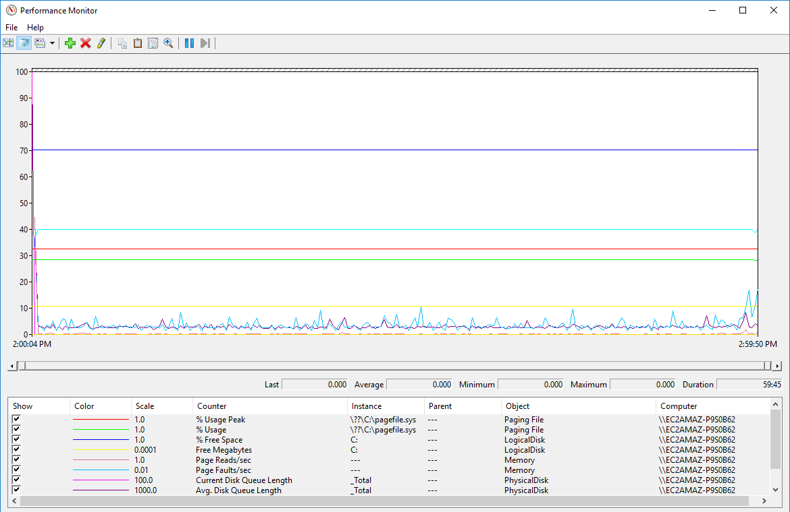
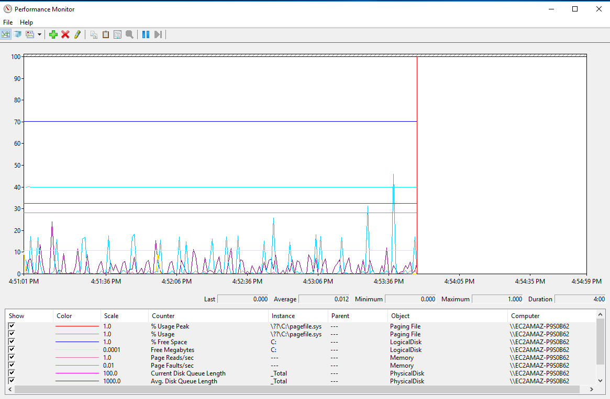
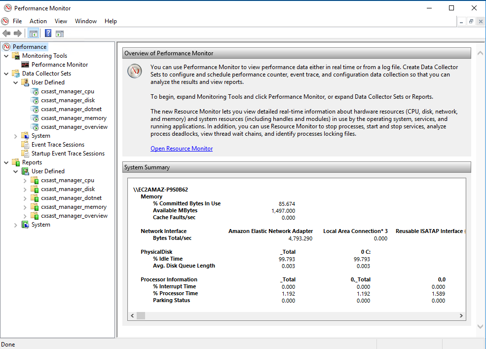
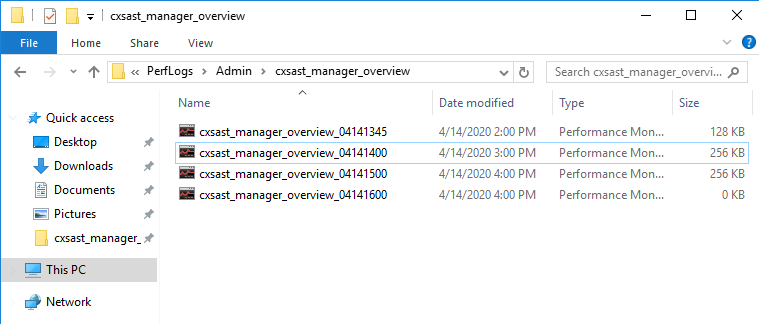

# Monitoring system performance with Perfmon

Monitoring key performance counters is a best practice for Checkmarx. This script makes it easy to get up and running with Perfmon to monitor your Checkmarx infrastructure. 

# What does it do?
This script creates Data Collector Sets in perfmon that record key performance counters about your system's CPU, Memory, Disk, and Dotnet application performance. Logs are saved in 1 hour intervals, use 15 second sample interval, and kept for 7 days. 

Data Collector Set | Description
--------|------------
cxsast_manager_overview | Consolidated key metrics related to CPU, disk, memory, and dotnet 
cxsast_manager_cpu | Detailed metrics related to CPU usage
cxsast_manager_disk |  Detailed metrics related to disk usage 
cxsast_manager_dotnet |  Detailed metrics related to the dotnet Checkmarx applications
cxsast_manager_memory |  Detailed metrics related to memory usage 


# Install / Uninstall

Install with this command:

  ```.\install-cx-perfmon.ps1```
  
Uninstall with this command:

  ```.\install-cx-perfmon.ps1 -Uninstall```

# Usage
## Viewing historical metrics from the logs
Find the log file (.blg extension) you are interested in at ```C:\PerfLogs\Admin\``` and double click it. The log file will open in perfmon and you can inspect it the data. Each log file holds 1 hour of data. 

To add more log files in your analysis, click the *View Log Data* button from the toolbar (keyboard shortcut: ```CTRL+L```). Add additional log files, click *Apply*, adjust the Time Range to show all of the total range, and click *Ok*.

## Viewing current metrics
Open a log file of interest. Click the *View Current Activity* button from the toolbar (keyboard shortcut: ```CTRL+T```).

# Screenshots
## Perfmon History/Log File View


## Perfmon Current Activity View


## Perfmon Data Collector Sets


## Perfmon Log Files


# Modifications

A few things you can easily do...
* Add or remove counters from the collector sets
* Change the data retention time period (default is 7 days)
